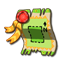
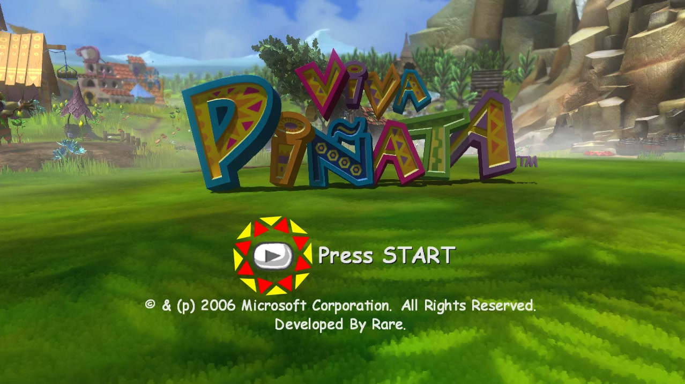
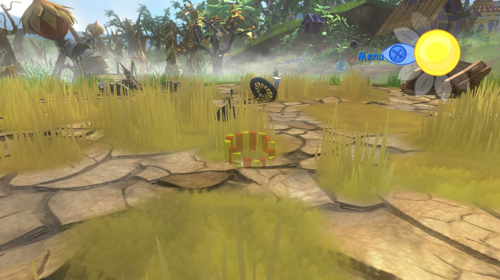

<div align="center">



# Viva Piñata Recomp

**Viva Piñata (Xbox 360, 2006) running natively on Windows PC**

**English** · [Русский](README.ru.md)

[](#what-you-need)
[](#which-game-version-you-need)
[](https://github.com/rexglue/rexglue-sdk)
[](#settings)
[](#what-works)
[](#russian-language)

 

</div>

---

## What is this?

The original Xbox 360 game, converted into a normal Windows program. It is **not an emulator**: the game's code was translated to C++ with [ReXGlue SDK](https://github.com/rexglue/rexglue-sdk) ("static recompilation"). The game has a launcher and can optionally use a Russian translation.

> [!IMPORTANT]
> **No game files are included.** You need your own copy of the game, and it must be one specific version (see below).

## What you need

- A Windows 10 or 11 PC (64-bit) with a DirectX 12 graphics card.
- About **25 GB** of free disk space (Visual Studio ~12 GB, the game ~5 GB, the disc image ~8 GB while unpacking).
- Your own disc image (`.iso`) of **Viva Pinata (USA, Europe)** for Xbox 360. It must be exactly the version below.

## Which game version you need

| | |
| :-- | :-- |
| **Disc (Redump name)** | `Viva Pinata (USA, Europe) (En,Ja,Fr,De,Es,It,Nl,Pt,Sv,No,Zh,Ko,Pl,Cs,Hu,Sk)` |
| **Title ID / Media ID** | `4D5307F2` / `690B3287` |
| **Version** | `0.0.0.1`, the original disc, no title update needed |
| **ISO checksum** | MD5 `3902321dfe15d7d2510a96114dba625a`, CRC32 `f3ddf9d3` |

Other editions have not been tested and will probably not start. *Viva Piñata: Trouble in Paradise* and *Viva Piñata: Party Animals* are different games. You do not need the bonus disc.

## The easy way: let an AI agent install it

1. Install an AI assistant that can run commands on your computer, for example [Claude Code](https://claude.com/claude-code), OpenAI Codex or Cursor.
2. Paste this message into it, with the real path to your ISO:

   > Install Viva Piñata Recomp on this PC: https://github.com/crabinacrabic/VivaPinataRecomp — follow AGENTS.md from that repository. My game disc image is at `C:\path\to\Viva Pinata.iso`. I also want the Russian language: no / yes.

3. The agent downloads and checks everything. When it asks, click through the Visual Studio installer and press **Build** in Visual Studio.
4. When it is done, double-click **`run_game.bat`** in the project folder.

## Doing it yourself (6 steps)

1. **Install the tools.** You need:
   - [Visual Studio 2026 Community](https://visualstudio.microsoft.com/) (free), with the workload **Desktop development with C++** and the component **C++ Clang tools for Windows**;
   - [Git](https://git-scm.com/).
2. **Download the project.** Use a folder path that contains only English letters, then run:
   ```bash
   git clone https://github.com/crabinacrabic/VivaPinataRecomp.git C:\Games\VivaPinataRecomp
   ```
3. **Unpack the game** with [extract-xiso](https://github.com/XboxDev/extract-xiso/releases/latest) (file `extract-xiso-Win64_Release.zip`):
   ```bash
   extract-xiso -x -d C:\Games\VivaPinataRecomp\game_files "C:\path\to\Viva Pinata (USA, Europe).iso"
   ```
   Afterwards `game_files` must contain `default.xex` and a `Beta` folder.
4. **Build it.**
   - In Visual Studio: **File → Open → Folder…** → select `C:\Games\VivaPinataRecomp`.
   - Wait until the Output window says the CMake generation has finished. The first time takes a few minutes: it downloads the SDK and converts the game code.
   - In the toolbar, choose the configuration **`local-win-relwithdebinfo`**.
   - Click **Build → Build All** (`F7`).
5. **Start it:** double-click **`run_game.bat`**.
6. **In the launcher** press **PLAY** (or `Enter`). A green status line means the game was found and the version is right.
   - **Settings** has the game text language, fullscreen, V-Sync, render resolution, render mode and the launcher language.
   - The launcher speaks English or Russian and follows your Windows language. The **EN / RU** button in the top-right corner switches it.

## Russian language

The Xbox disc has no Russian. This project moves the fan translation of the **PC version** by **ZoG Team** ([zoneofgames.ru](https://www.zoneofgames.ru/)) onto the Xbox game, with the team's permission. The translation is not stored in this repository.

1. Download **[VivaPinata_Russian_v1.zip](https://disk.yandex.ru/d/9lgjQVp7fArEjw)** (Yandex Disk, 255 KB). It holds only the Russian text, no game files.
2. Unzip it into the project folder, so that `translation\vp_russian.json` appears.
3. Install [Python 3](https://www.python.org/) and [7-Zip](https://www.7-zip.org/), then run in the project folder:
   ```bash
   python tools/make_russian_bnl.py
   ```
4. In the launcher, choose **Settings → Game text language → Russian**.

If you have the PC version with the ZoG translation installed, `python tools/make_russian_bnl.py --pc-ru "<PC game>/bundles/english.bnl" --pc-en "<PC game>/Install_Rus/backup/bundles/english.bnl"` builds the same file from it.

12 446 of 12 460 strings are translated; only the credits stay in English. You can switch back to English at any time.

## Controls

The game is made for an Xbox controller, which works right away. The keyboard and mouse can also be used:

| Controller | Keyboard | | Controller | Keyboard |
| :-- | :-- | :-- | :-- | :-- |
| Left stick (cursor) | `W` `A` `S` `D` | | **A** | `Space` |
| Right stick (camera) | arrows, mouse | | **B** | `Backspace` |
| D-pad | `Shift` + arrows | | **X** | `L` |
| **LT / RT** | `Q` / `E` | | **Y** | `P` |
| **LB / RB** | `1` / `3` | | **Start** | `Enter` |
| **L3 / R3** | `F` / `K` | | **Back** | `Tab` |

The keys can be changed in [`settings/mapping.toml`](settings/mapping.toml).

## Settings

Most settings are in the launcher. Everything else is in [`settings/hardware.toml`](settings/hardware.toml). The launcher saves its own choices to `settings/launcher.toml`; delete that file to reset them.

## What works

| | |
| :-- | :-- |
| ✅ | Menus, title screen, the garden and the whole game |
| ✅ | Sound, Xbox controller, keyboard and mouse |
| ✅ | Launcher in English and Russian, with a game version check and graphics settings |
| ✅ | Russian text (ZoG Team translation) |
| 🚧 | Skipping intro videos and unlocking 30 FPS are not done yet |
| 🚧 | Direct3D 12 only |

## If something goes wrong

| Problem | What to do |
| :-- | :-- |
| Red line in the launcher | The game files are missing or the version is wrong: check `game_files\default.xex` and the version table above |
| Build error `Microsoft Visual C/C++ Version differs in precompiled file` | Visual Studio was updated. Delete `out\build\local-win-relwithdebinfo\CMakeFiles\vivapinata_recomp.dir\cmake_pch.hxx.pch` and build again |
| Code generation fails with `0xC0000409` | The project path contains non-English characters. Move the project, for example to `C:\Games\VivaPinataRecomp` |
| Visual Studio stops at "Access violation" in `memcpy` when started with `F5` | This is not a crash. Turn off breaking on `0xC0000005` (Debug → Windows → Exception Settings), or start with `Ctrl+F5` / `run_game.bat` |

Logs are written to `out\build\local-win-relwithdebinfo\logs\`. Detailed technical instructions: **[AGENTS.md](AGENTS.md)**.

## For developers

How the project is organised, the development rules and the important fixes: [AGENTS.md](AGENTS.md), section 2. The two biggest fixes:
- a ReXGlue code generator bug that made the ground white (`vpkd3d128` lost the sign of numbers, [`src/game_fixes.h`](src/game_fixes.h));
- in-place decompression of Rare's CAFF files, which the Russian text bundle has to respect ([`tools/make_russian_bnl.py`](tools/make_russian_bnl.py)).

## Credits

- [ReXGlue SDK](https://github.com/rexglue/rexglue-sdk): recompiler and runtime
- [Xenia](https://github.com/xenia-project/xenia) and [Xenia Canary](https://github.com/xenia-canary/xenia-canary): graphics backend, and the reference used for comparison
- [TiP-Recomp](https://github.com/SolarCookies/TiP-Recomp): project architecture reference (Viva Piñata: Trouble in Paradise)
- ZoG Team ([Zone of Games](https://www.zoneofgames.ru/)): the Russian translation of the PC version
- Rare: for a wonderful game

## Legal

This project is not affiliated with or endorsed by Microsoft or Rare. It contains no game files; you need your own legally obtained copy. Viva Piñata is a trademark of Microsoft Corporation.
